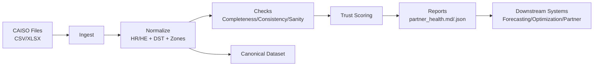
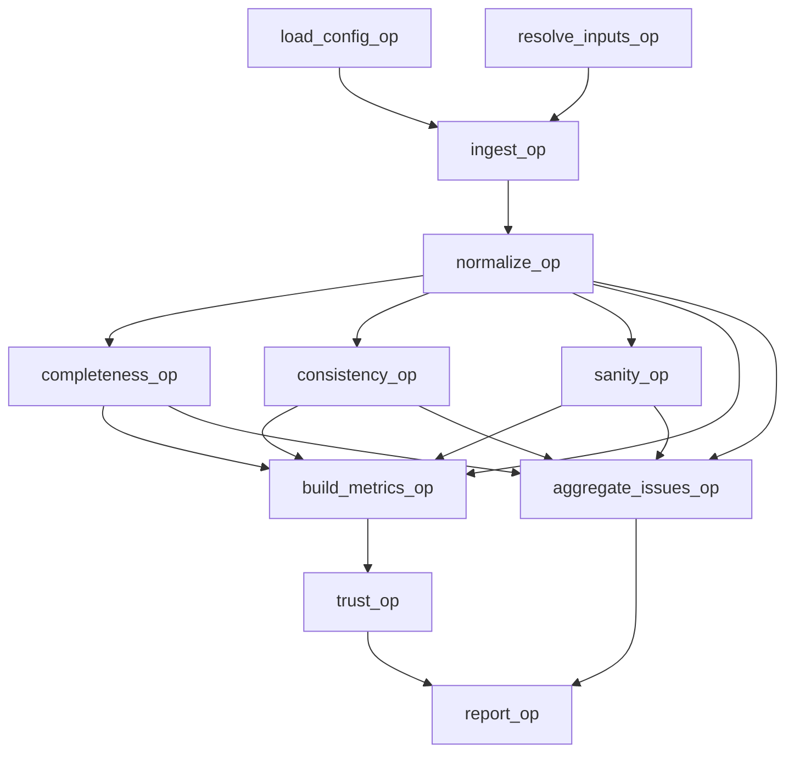

# ISO Load Integrity & Trust Platform – CAISO Edition

## Purpose
This project builds a production-ready trust layer for CAISO load data. The goal is to validate, normalize, and score ISO feeds before they are used by downstream forecasting, optimization, or partner-facing products. The system provides both human-readable and machine-readable trust signals and is designed to scale to additional ISOs with config-driven behavior.

## Why This Is Necessary
CAISO and other ISOs publish load data that is known to have:
- DST anomalies (23/25 hour days).
- Schema drift (HR vs HE, CAISO vs CAISO Total, optional Note columns).
- Missing intervals and silent corrections.
- Inconsistent units and internal mismatches between zonal sums and reported totals.

Without a trust layer, downstream systems can ingest flawed data without visibility. This project creates an auditable, repeatable validation pipeline that flags issues early and provides a clear “go/no‑go” signal.

## What Was Built

### 1) Canonical Data Model
A normalized internal format is enforced so downstream systems work with a consistent schema:
- `timestamp_local` (timezone-aware)
- `timestamp_utc`
- `iso`
- `zone` (PGE, SCE, SDGE, VEA, CAISO_TOTAL)
- `mw`
- `source_file`
- `flags` (row-level annotations)

### 2) DST & Calendar Intelligence
Explicit DST handling was implemented:
- Detects 23/24/25 hour days.
- Disambiguates fall-back duplicate hours and flags ambiguous rows.
- Preserves correctness instead of silently dropping anomalies.

### 3) Data Integrity Checks
Core checks included:
- Completeness by day and by zone (missing intervals).
- Internal consistency of CAISO total vs sum of zones.
- Value sanity: negatives, spikes, flatlines.

### 4) Trust Scoring
A configurable trust score (0–100) is computed from penalties for:
- Missing hours
- Missing zones
- DST anomalies
- Consistency violations
- Value anomalies

Outputs:
- Trust Score and Trust Level (HIGH / DEGRADED / DO_NOT_USE)
- Component breakdown for auditability

### 5) Outputs
Per input batch, the system generates:
- `partner_health_report.md` (partner‑facing summary)
- `partner_health.json` (pipeline‑ready metrics)

### 6) CLI + Pipeline Integrations
- CLI: `iso-trust validate --input ... --config ... --outdir ...`
- Dagster jobs (daily, monthly, backfill, and full sweep)
- Prefect flow option

## System Architecture

### High-Level Components
- **Ingestion**: Reads CAISO inputs (CSV/XLSX), captures source metadata.
- **Normalization**: Converts HR/HE to canonical timestamps, maps zone labels, flags DST anomalies.
- **Validation**: Runs completeness, consistency, and sanity checks.
- **Scoring**: Computes a trust score and level with a transparent breakdown.
- **Reporting**: Writes partner-facing Markdown and machine-readable JSON.
- **Orchestration**: Dagster/Prefect pipelines for scheduled or ad-hoc runs.

### Data Flow Diagram (Mermaid)



### Detailed DAG View (Ops)



### Storage and Auditability
- **Inputs**: Original ISO files retained for traceability.
- **Artifacts**: Reports stored by run and by job (daily/monthly/backfill).
- **Metrics**: JSON output can be indexed by pipeline systems for alerting.

## Key Engineering Decisions

### Config-Driven ISO Onboarding
ISO behavior (timezone, hour semantics, zones, thresholds) is driven by YAML config. This avoids per‑ISO code changes and supports rapid onboarding of new feeds.

### Production-Quality Normalization
The normalization layer handles:
- HR vs HE variants
- CAISO vs CAISO Total naming
- Note/Unnamed columns from XLSX exports
- Explicit DST disambiguation with flags

These are real CAISO artifacts seen in the provided Excel files.

### Pipeline-Ready Architecture
The validation logic was refactored into a reusable runner and decomposed into Dagster ops for UI visibility and scheduling. This enables:
- Visible DAG execution
- Reproducible batch runs
- Automation via schedules

## Operational Runbook (Recommended)

1. **Daily**: Run `caiso_daily_trust_job` and review any HIGH severity issues.
2. **Monthly**: Run `caiso_monthly_updates_job` after CAISO publishes monthly files.
3. **Backfill**: Run `caiso_historical_backfill_job` as needed for historical corrections.
4. **Escalation**: If trust level is DO_NOT_USE, block downstream usage and open a data ticket.
5. **Audit**: Store `partner_health.json` per file for traceability.

## What Files Were Added or Modified

New package for trust platform:
- `src/iso_trust/cli.py`
- `src/iso_trust/runner.py`
- `src/iso_trust/config.py`
- `src/iso_trust/ingest.py`
- `src/iso_trust/normalize.py`
- `src/iso_trust/dst.py`
- `src/iso_trust/checks/completeness.py`
- `src/iso_trust/checks/consistency.py`
- `src/iso_trust/checks/sanity.py`
- `src/iso_trust/scoring.py`
- `src/iso_trust/report.py`
- `src/iso_trust/pipelines/dagster_pipeline.py`
- `src/iso_trust/pipelines/prefect_flow.py`

Config and example artifacts:
- `configs/caiso.yaml`
- `examples/partner_health_report.md`

Packaging and docs:
- `pyproject.toml` (entry points + optional deps)
- `README.md` (usage + pipeline instructions)

## Results Achieved
- The CAISO Excel inputs are now ingested correctly, including files that differ in schema.
- The report output highlights real-world issues (missing hours, DST effects, inconsistencies).
- Dagster UI loads full graphs for each job, and the system can run daily/monthly/backfill or as a combined sweep.

## How to Run

CLI:
```bash
iso-trust validate --input data/*.xlsx --config configs/caiso.yaml --outdir out
```

Dagster UI:
```bash
dagster dev -f src/iso_trust/pipelines/dagster_pipeline.py
```

Then run:
- `caiso_daily_trust_job`
- `caiso_historical_backfill_job`
- `caiso_monthly_updates_job`
- `caiso_full_sweep_job`

## Risk Controls and Guardrails
- **Fail Fast**: Hard errors for missing schema fields or invalid hour values.
- **DST Transparency**: All DST anomalies flagged and preserved in the canonical set.
- **Consistency Thresholds**: Config-driven limits for total vs zonal mismatches.
- **Versioned Output**: Reports are deterministic and can be diffed across runs.

## Next Logical Enhancements
- Ingestion ledger with file hashes and schema drift detection.
- Corrections detection (compare new vs previously ingested versions).
- Trust score sensitivity based on seasonality and ISO‑specific risk profiles.
- HTML/PDF partner report with charts and DST timelines.
- Warehouse export (Parquet) for downstream analytics.

